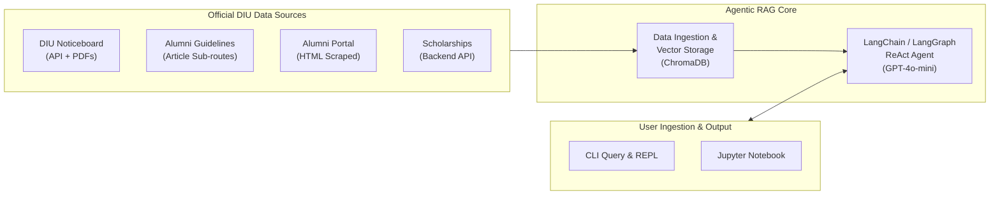

# DIU Konnect (KonnectBuddy) Documentation

Welcome to the official technical documentation for **DIU Konnect (KonnectBuddy)**, a standalone Agentic Retrieval-Augmented Generation (RAG) system engineered for Daffodil International University (DIU).

This documentation suite provides architectural insights, detailed workflow diagrams, data engineering procedures, agent and prompt design, API references, and deployment guides.

---

## 📚 Documentation Index

| Document | Focus Area | Description |
| :--- | :--- | :--- |
| **[Architecture Overview](architecture.md)** | System Design | Detailed architecture diagrams, layer breakdowns, and technology choices. |
| **[Workflow & State Machine](workflow.md)** | Agent Logic | Complete Mermaid diagrams illustrating the ReAct loop, ingestion sequence, state transitions, and decision trees. |
| **[Data Pipeline & Scraping](data_pipeline.md)** | Ingestion & Storage | Next.js REST API extraction, PDF parsing, text chunking, and ChromaDB vector indexing. |
| **[Agent & Prompt Engineering](agent_and_prompt_engineering.md)** | Agent Intelligence | LangChain/LangGraph ReAct setup, system prompt grounding rules, and cross-lingual canonical query mapping. |
| **[Setup & Deployment Guide](setup_and_deployment.md)** | Operations | Step-by-step installation, environment configuration, CLI modes, and troubleshooting. |
| **[API & CLI Reference](api_and_cli_reference.md)** | Technical Reference | Signatures, parameters, return types for all functions, tools, and command-line arguments. |
| **[Benchmarks & Evaluation](benchmarks_and_evaluation.md)** | Quality Assurance | Test suite analysis, cross-lingual queries (Bengali/Banglish/English), and citation verification. |

---

## 🌟 System High-Level Overview

DIU Konnect is designed to eliminate hallucinations by restricting the bot's factual domain strictly to verified, official DIU institutional sources:
1. **DIU Noticeboard**: Real-time administrative, academic, and exam notices (including attached PDF circulars).
2. **Alumni Association Portal & Guidelines**: Card collection protocols, fee structures, and membership requirements.
3. **Scholarship & Financial Aid Portal**: Dynamic accordion policies, waiver thresholds, and criteria tables.

---

## ⚡ Key Highlights

- **Dynamic Scraping Engine**: Bypasses empty Next.js client-side rendered HTML by integrating directly with DIU's backend endpoints (`webbackend.daffodilvarsity.edu.bd`).
- **Binary PDF Extraction**: Downloads and reads official notice PDFs directly in memory via `pypdf`.
- **Hybrid ReAct Agent**: Supports both modern LangGraph (`create_react_agent`) and classic LangChain (`create_agent`) runtimes.
- **Cross-Lingual Intent Bridge**: Accurately processes Bengali, Banglish, and English questions, translating internal search queries into canonical English for maximal vector similarity.
- **Strict Grounding Guardrails**: Zero-tolerance hallucination policy with mandatory URL citations.

---

## 🚀 Quick Navigation

- Want to run the project right away? See the **[Setup & Deployment Guide](setup_and_deployment.md)**.
- Want to inspect the agent's reasoning loop? See **[Workflow & State Machine](workflow.md)**.
- Want to understand how dynamic APIs and PDFs are indexed? See **[Data Pipeline & Scraping](data_pipeline.md)**.
