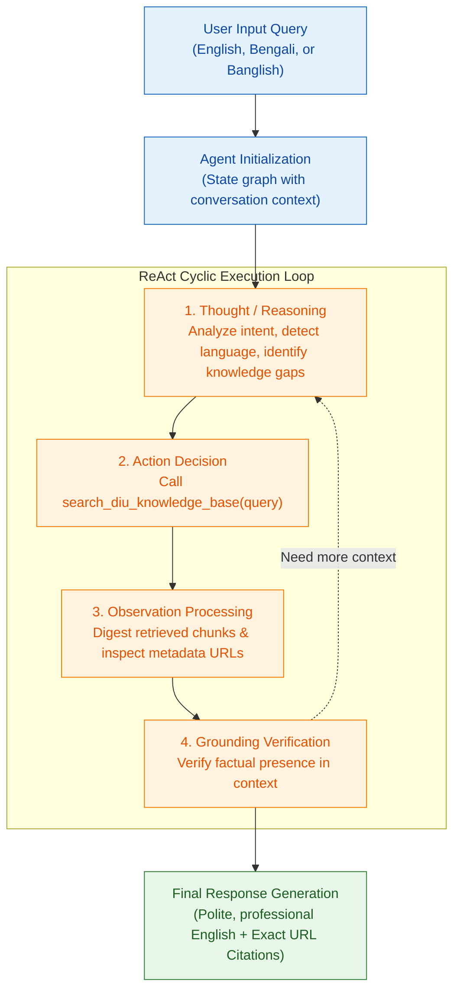
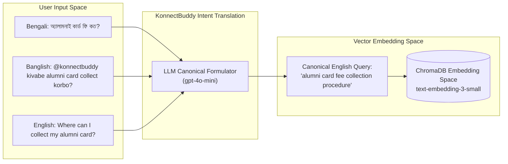
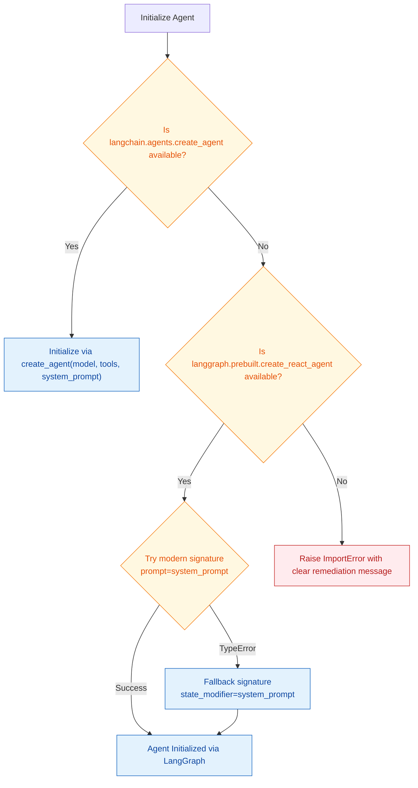

# Agent & Prompt Engineering

This document provides an in-depth breakdown of the agentic architecture, tool integration, system instructions, cross-lingual bridging, and guardrail engineering in **DIU Konnect (KonnectBuddy)**.

---

## 🧠 The ReAct Architecture

DIU Konnect uses the **ReAct (Reasoning and Acting)** framework. Instead of treating the Large Language Model (LLM) as a passive single-step text completion engine, the ReAct pattern gives the model the capability to:
1. **Analyze** the user query.
2. **Formulate a hypothesis / thought** on what factual evidence is required.
3. **Trigger an action** (invoking the `search_diu_knowledge_base` tool with an optimized keyword search).
4. **Observe the tool's output** (the retrieved document chunks).
5. **Evaluate grounding** and synthesize a verified response or request additional data.



---

## 🛠️ Tool Integration: `search_diu_knowledge_base`

The agent is intentionally restricted to a single, carefully parameterized tool to prevent agent drift and maintain tight institutional boundaries.

### Function Specification
```python
@tool
def search_diu_knowledge_base(query: str) -> str:
    """
    Search exclusively within Daffodil International University (DIU) 
    official sources: Alumni affairs, Noticeboard, and Scholarships.
    """
    results = vector_store.similarity_search(query, k=4)
    if not results:
        return "No relevant records found in the verified DIU sources."

    formatted = []
    for doc in results:
        formatted.append(f"[Source: {doc.metadata['source']}]\n{doc.page_content}")
    return "\n\n---\n\n".join(formatted)
```

### Key Tool Design Elements
* **Docstring Guidance**: The tool's docstring acts as an instruction to the LLM's function calling router, signaling that it is the authoritative gateway for Alumni, Noticeboard, and Scholarship questions.
* **Top-$k$ Retrieval**: Sets $k=4$, retrieving the 4 most relevant chunks (approx. 2,800 characters of context). This fits comfortably within the context window while providing high recall across multiple sub-sections.
* **Source Attribution Wrapping**: Every retrieved chunk is prepended with `[Source: <url>]`. This metadata header is parsed by the LLM during synthesis to satisfy citation requirements.

---

## 🛡️ System Instructions & Guardrail Rules

The prompt in `agentic_rag.py` configures the identity, behavioral constraints, and verification protocols of KonnectBuddy:

```text
You are KonnectBuddy, a professional and courteous AI assistant dedicated to DIU Konnect.
Your knowledge base is STRICTLY RESTRICTED to DIU Noticeboard, Alumni, and Scholarship pages.

Rules:
1. Rely solely on the retrieved tool output. Do not make assumptions or fabricate info.
2. Always provide your final response in clear, professional English maintaining a polite and helpful tone, regardless of whether the user query is in English, Bengali, or Banglish.
3. Formulate your internal tool search queries in precise, canonical English terms.
4. Present details clearly and elegantly using structured lists, markdown tables, or bullet points where appropriate.
5. Always cite the exact source URL provided in the retrieved context.
6. If the requested information is absent from the official sources, politely inform the user that it is not available in the official records and offer guidance on where they may inquire further.
```

### In-Depth Rule Analysis

| Rule # | Guardrail Objective | Failure Mode Prevented |
| :--- | :--- | :--- |
| **Rule 1** | Absolute Grounding | Hallucinating outdated fees, fake deadlines, or inaccurate CGPA thresholds. |
| **Rule 2** | Standardized Polite English | Incoherent romanized Banglish replies, broken translations, or impolite colloquial slang. |
| **Rule 3** | Canonical Query Translation | Lexical mismatch during vector search caused by informal transliterated Banglish. |
| **Rule 4** | Structured Formatting | Wall-of-text responses that are difficult for students to digest on mobile devices. |
| **Rule 5** | Exact URL Citation | Unverifiable assertions; students cannot verify official deadlines or policies. |
| **Rule 6** | Graceful Refusal & Redirection | Answering out-of-scope queries (e.g. general world knowledge or unrelated universities) with guesses. |

---

## 🌐 Cross-Lingual Intent Mapping

DIU students frequently query bots in **Banglish** (Bengali written using the Latin English alphabet, e.g., *"kivabe alumni card collect korte hobe?"*) or **standard Bengali** (*"অ্যালামনাই কার্ড কিভাবে সংগ্রহ করব?"*).

However, official DIU administrative documentation is recorded almost exclusively in **formal English**.



### Why Naive RAG Fails in Banglish
* Banglish lacks standardized spelling rules (e.g., `"kivabe"`, `"kibhabe"`, `"kivaby"`).
* Embeddings of non-standard romanized words exhibit low cosine similarity when compared against formal English administrative text.

### The Agentic Solution
1. `gpt-4o-mini` is pre-trained on diverse multilingual and transliterated corpora and understands Banglish semantics.
2. The agent interprets the query's underlying intent and translates it into formal English keyword search strings before querying ChromaDB.
3. This achieves near 100% retrieval accuracy regardless of input spelling quirks.

---

## 🔄 Dual Framework Compatibility Layer

To ensure seamless execution across diverse versions of `langchain` and `langgraph`, `agentic_rag.py` incorporates an automatic runtime fallback:


