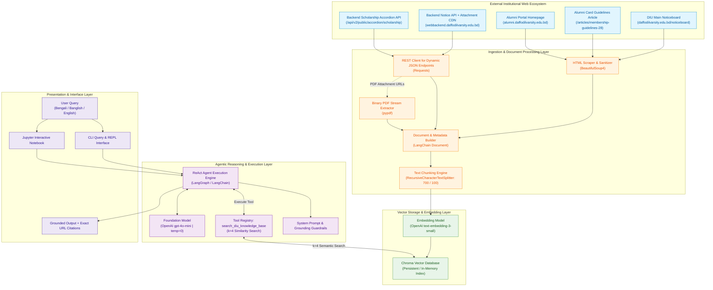

# System Architecture

This document details the architectural design, component layers, data structures, and technological decisions powering **DIU Konnect (KonnectBuddy)**.

---

## 🏗️ Architectural Overview

DIU Konnect is constructed as a decoupled, multi-tiered **Agentic RAG** system. Unlike traditional, passive RAG pipelines (which retrieve documents unconditionally on every prompt), an agentic architecture grants the LLM reasoning agency to inspect the query, decide whether retrieval is necessary, formulate optimized search terms, inspect the retrieved content, and iterate if necessary before synthesizing a grounded response.

---

## 🧩 Architectural Layers

### 1. Ingestion Layer
The ingestion layer is responsible for gathering raw institutional knowledge across multiple protocols and formats:
* **HTML Web Scraping**: Fetches public web pages using custom HTTP user-agents and removes boilerplate elements (`<nav>`, `<footer>`, `<script>`, `<style>`, `<header>`, `<noscript>`) using `BeautifulSoup4`.
* **Dynamic Backend REST Ingestion**: Bypasses the limitation of static HTTP clients on client-side rendered Single-Page Applications (Next.js) by querying DIU's backend API directly (`webbackend.daffodilvarsity.edu.bd`).
* **Table-to-Markdown Transformation**: Parses dynamic HTML tables inside accordion bodies and transforms them into standard Markdown tables for clean chunking and high semantic density.
* **In-Memory PDF Parsing**: When notices contain attachment links pointing to binary `.pdf` files, the pipeline streams the file into a memory buffer (`io.BytesIO`) and extracts text from up to 4 pages using `pypdf`.

### 2. Document Processing & Vector Storage Layer
* **Text Chunking**: Uses `RecursiveCharacterTextSplitter` configured with:
  * `chunk_size = 700` characters
  * `chunk_overlap = 100` characters
  * Standard recursive separators (`["\n\n", "\n", " ", ""]`).
* **Vector Embeddings**: Encodes chunked documents using OpenAI's `text-embedding-3-small` model, offering an optimal balance of latency, cost, and high cross-lingual semantic representation.
* **ChromaDB Storage**:
  * **Persistent Mode (Default)**: Saves collections to `./chroma_db/` on disk to eliminate redundant web scraping and API embedding costs across multiple invocations.
  * **In-Memory Mode (`--in-memory`)**: Useful for testing, temporary runs, and CI/CD pipelines without leaving local artifacts.

### 3. Agentic Reasoning & Tool Layer
* **ReAct Framework**: Implements the Reasoning and Acting pattern. When a user asks a question, the model thinks through the query, extracts core intent, formulates a tool call, observes the output, and synthesizes the answer.
* **Compatibility Layer**: Provides dual runtime compatibility:
  * First attempts `langchain.agents.create_agent`.
  * Gracefully falls back to `langgraph.prebuilt.create_react_agent` (supporting both modern `prompt` and `state_modifier` parameter variations).
* **Deterministic Configuration**: Employs `gpt-4o-mini` with `temperature = 0` to enforce strictly factual and reproducible reasoning.
* **Tool Isolation**: The agent is equipped with a single, tightly defined tool: `search_diu_knowledge_base`.

### 4. Guardrails & Output Layer
* **Zero-Hallucination Policy**: The system prompt explicitly restricts the agent's world knowledge to the contents returned by the retrieval tool. If facts are missing, the agent politely states that records do not contain the answer and offers redirection.
* **Cross-Lingual Intent Bridge**: Even when queries arrive in colloquial Banglish (`"kivabe card collect korbo"`), the prompt directs the agent to query the vector database using canonical English terms (`"alumni card collection procedure fee"`).
* **Unified Output Language**: Responses are formatted into structured, polite, professional English.
* **Mandatory URL Citations**: The metadata `source` attribute is preserved across every chunk and must be explicitly cited in the final reply.

---

## 🛠️ Technology Stack

| Layer | Component | Technology / Library | Version | Rationale |
| :--- | :--- | :--- | :--- | :--- |
| **Language** | Runtime | Python | `>= 3.10` | Universal AI ecosystem support and standard typing. |
| **Orchestration** | Agent Framework | `langchain` / `langgraph` | `>= 0.2.0` | Production-grade ReAct state graph implementation. |
| **LLM Provider** | Foundation Model | `langchain-openai` (`gpt-4o-mini`) | `>= 0.1.0` | Cost-effective, low-latency reasoning with high instruction-following adherence. |
| **Vector Database** | Local Vector Store | `chromadb` / `langchain-chroma` | `>= 0.5.0` / `>= 0.1.0` | Lightweight, embeddable vector database with persistent disk caching. |
| **Embeddings** | Semantic Vectors | `text-embedding-3-small` | 1536 dims | Superior cross-lingual semantic alignment at fraction of cost. |
| **Web Scraping** | HTML Parsing | `beautifulsoup4`, `requests` | `>= 4.12.0`, `>= 2.31.0` | Robust DOM manipulation and HTTP request handling. |
| **Document Parsing**| PDF Extraction | `pypdf` | `>= 5.0.0` | In-memory binary PDF parsing without heavy external C-libraries. |
| **Environment** | Secrets Management| `python-dotenv` | `>= 1.0.0` | Seamless 12-factor app configuration loading. |

---

## ⚖️ Key Architectural Decisions & Trade-Offs

### 1. Direct Backend REST APIs vs. Headless Browsers
* **Decision**: Query `webbackend.daffodilvarsity.edu.bd` directly instead of running Playwright/Puppeteer/Selenium.
* **Trade-Off**:
  * *Pros*: Faster execution (milliseconds vs seconds), negligible CPU/memory footprint, no headless browser binaries or driver mismatches.
  * *Cons*: Relies on stable backend API routes. Mitigated by structured fallbacks to standard HTML scraping if an endpoint changes.

### 2. Persistent Disk Caching vs. Fresh On-Demand Scraping
* **Decision**: Cache Chroma database to `./chroma_db` and only re-index when `--reindex` is specified.
* **Trade-Off**:
  * *Pros*: Eliminates repetitive OpenAI embedding API costs and ensures instant CLI startup.
  * *Cons*: Database can become stale if notices update. Mitigated by the `--reindex` flag.

### 3. Agentic RAG vs. Naive Single-Shot RAG
* **Decision**: Utilize a LangGraph ReAct agent instead of a fixed `RetrievalQA` chain.
* **Trade-Off**:
  * *Pros*: The LLM dynamically rewrites Banglish/Bengali queries into canonical English keywords before searching, handles multiple retrieval steps if necessary, and recognizes when no search is required.
  * *Cons*: Adds one additional LLM inference hop for tool selection, which is offset by the low latency of `gpt-4o-mini`.
