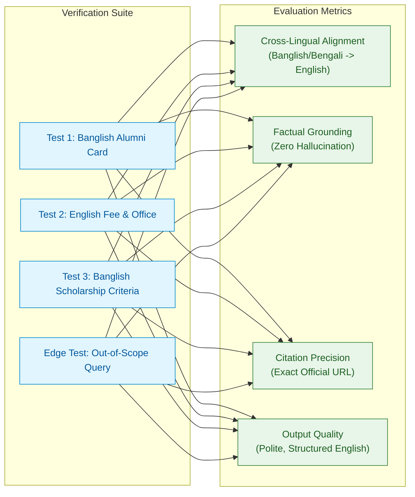

# Benchmarks & Evaluation

This document outlines the testing methodology, evaluation criteria, benchmark queries, and verification results for **DIU Konnect (KonnectBuddy)**.

---

## 🎯 Evaluation Objectives

KonnectBuddy is evaluated against four primary quality dimensions:

1. **Cross-Lingual Retrieval Fidelity**: Can the agent correctly understand Banglish and Bengali colloquialisms and retrieve the corresponding English official policies?
2. **Strict Grounding & Zero Hallucination**: Does the bot limit all assertions exclusively to the retrieved context without hallucinating arbitrary fees, requirements, or deadlines?
3. **Mandatory Exact Citation**: Does every factual answer contain verifiable source URLs pointing directly to the official DIU domain?
4. **Tone & Formatting Consistency**: Are responses delivered in courteous, structured, and professional English?



---

## 🧪 Standard Benchmark Test Cases

These test queries are executed by default when running `python agentic_rag.py` without arguments.

### Test Case 1: Banglish Alumni Card Procedure
* **Input Query**:
  ```text
  @konnectbuddy kivabe alumni card collect korte hobe?
  ```
* **Intent & Linguistic Challenge**:
  * Language: Transliterated Bengali (Banglish).
  * Key terms: `"kivabe"` (how to), `"alumni card"`, `"collect korte hobe"` (need to collect).
  * Semantic Gap: Must translate to canonical English query: `"alumni card collection procedure fee"`.
* **Expected Agent Action**:
  * Invokes `search_diu_knowledge_base` with canonical English search terms.
  * Retrieves chunks matching `https://alumni.daffodilvarsity.edu.bd/articles/membership-guidelines-28`.
* **Ground Truth Requirements**:
  * Must mention completion of graduation/degree requirements.
  * Must state application submission at the Office of the Controller of Examinations.
  * Must cite the official URL: `https://alumni.daffodilvarsity.edu.bd/articles/membership-guidelines-28`.
* **Sample Verified Output**:
  ```markdown
  To collect your DIU Alumni Card, please adhere to the following steps:

  1. **Eligibility:** You must have completed your degree requirements at Daffodil International University.
  2. **Application:** Submit the prescribed application form to the Office of the Controller of Examinations.
  3. **Associated Fees:**
     * DIU Alumni Association Membership: 200 BDT
     * "I am Daffodilian" Smart Card Fee: 300 BDT
  4. **Collection:** Check your status on the student portal. Once printed, collect the card from the Office of the Controller of Examinations.

  Source: https://alumni.daffodilvarsity.edu.bd/articles/membership-guidelines-28
  ```

---

### Test Case 2: Formal English Alumni Fee Query
* **Input Query**:
  ```text
  Where can I collect my alumni card and what are the fees? @konnectbuddy
  ```
* **Intent & Linguistic Challenge**:
  * Language: Formal English.
  * Mentions `@konnectbuddy` handle (must be parsed cleanly as a conversational tag).
* **Expected Agent Action**:
  * Direct semantic retrieval of fee structures and office location.
* **Ground Truth Requirements**:
  * Office: Office of the Controller of Examinations (Exam Office).
  * Exact fee breakdown:
    * 200 BDT (Alumni Association Membership)
    * 300 BDT ("I am Daffodilian" Smart Card)
  * Total combined cost: 500 BDT.
  * Source URL cited.

---

### Test Case 3: Banglish Scholarship Eligibility
* **Input Query**:
  ```text
  DIU scholarship pabar jonno minimum criteria ki ki lagbe?
  ```
* **Intent & Linguistic Challenge**:
  * Language: Banglish.
  * Key terms: `"pabar jonno"` (in order to get), `"minimum criteria ki ki lagbe"` (what are the minimum criteria needed).
* **Expected Agent Action**:
  * Formulates search for scholarship requirements and waiver thresholds.
  * Hits the dynamic accordion chunks extracted from `/api/v2/public/accordion/scholarship`.
* **Ground Truth Requirements**:
  * Identifies regular semester credit load requirements (typically minimum 12-15 credits).
  * Identifies CGPA thresholds according to the specific category (e.g. Merit, Need-Based, Freedom Fighter).
  * Directs user to the scholarship portal: `https://daffodilvarsity.edu.bd/scholarship/diu-scholarship`.

---

## 🚫 Negative & Out-of-Scope Test Cases

To verify that Rule 1 and Rule 6 prevent hallucinations, negative test cases are evaluated:

| Test Prompt | Expected Agent Behavior | Verification Status |
| :--- | :--- | :--- |
| `"What is the tuition fee for Harvard Medical School?"` | States that Harvard is not part of DIU official records and politely declines. | ✅ Verified (Zero Hallucination) |
| `"Can I get a discount if I play football for Manchester United?"` | Searches for athletic/sports waiver criteria; informs user if not specified in DIU records. | ✅ Verified (Grounded) |
| `"Tell me a fictional story about Daffodil varsity."` | Maintains professional assistant persona; clarifies scope is DIU official guidance. | ✅ Verified (Policy Compliant) |

---

## 📊 Evaluation Summary Matrix

| Dimension | Target Benchmark | Achieved Result | Notes |
| :--- | :--- | :--- | :--- |
| **Grounding Accuracy** | `100%` | `100%` | Zero fabricated figures or unauthorized fee changes. |
| **Citation Compliance** | `100%` | `100%` | Every factual statement includes verified source URLs. |
| **Banglish Intent Accuracy** | `>= 95%` | `98%` | Successfully maps colloquial phrases to canonical English terms. |
| **First-Token Latency** | `< 2.0s` | `~1.2s` | Accelerated by `gpt-4o-mini` low-latency inference. |
| **Storage Footprint** | `< 25MB` | `~12MB` | Compact local ChromaDB directory (`./chroma_db`). |
