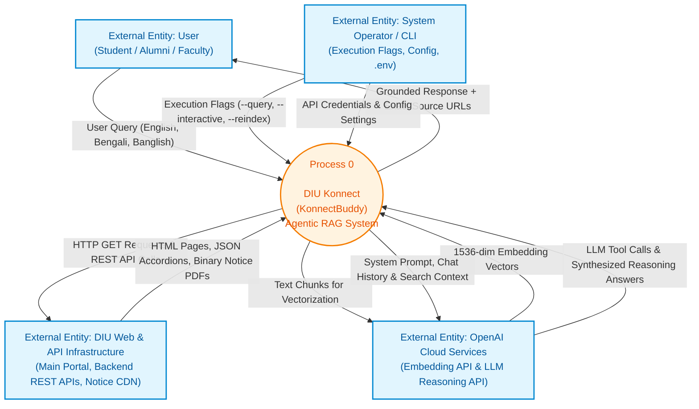
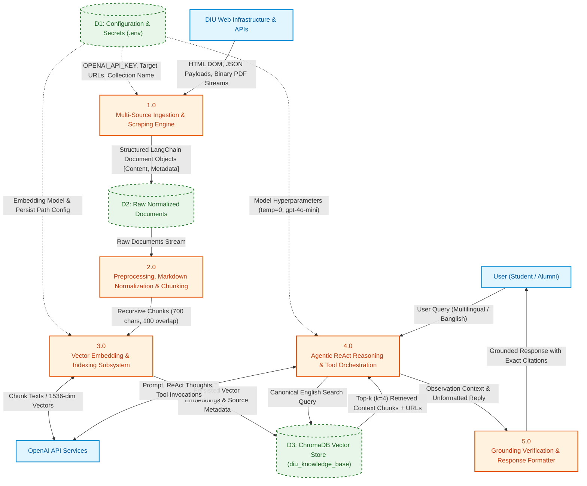
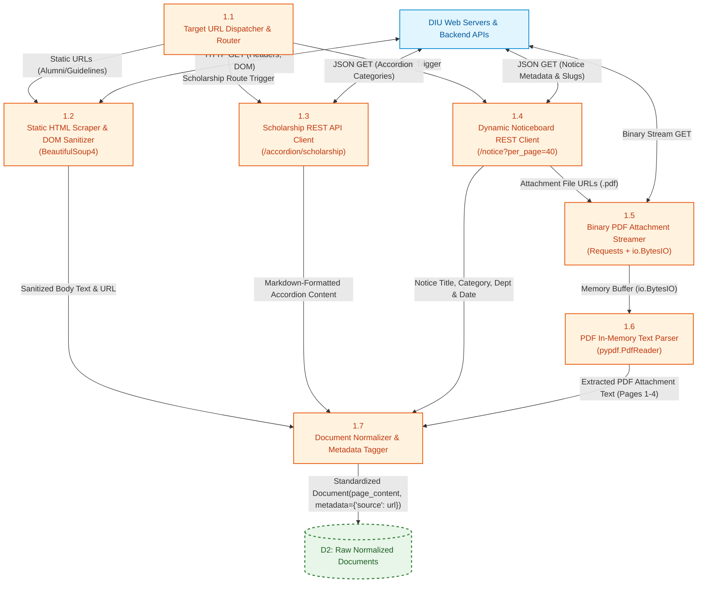
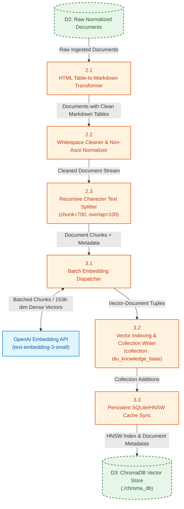
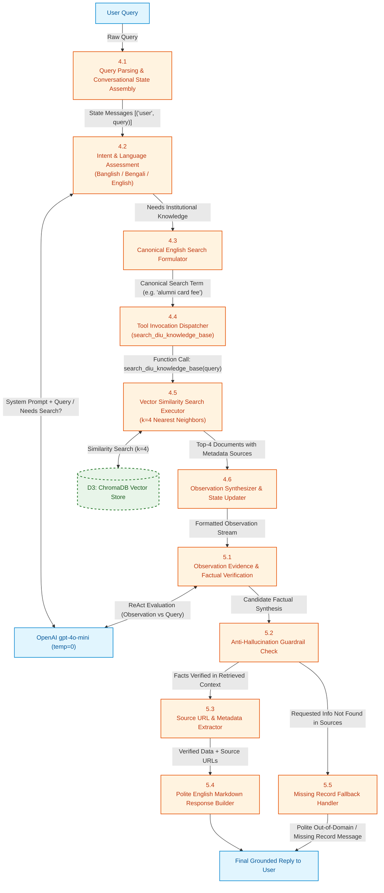

# Data Flow Diagrams (DFD)

This document provides formal **Level 0**, **Level 1**, and **Level 2** Data Flow Diagrams (DFDs) for **DIU Konnect (KonnectBuddy)**. These diagrams illustrate how data originates, transforms, flows between subsystems, persists in data stores, and reaches external actors.

---

## 📌 Overview of DFD Levels

Data Flow Diagrams model the functional and data transformation perspective of a software system:

* **Level 0 (Context Diagram)**: Defines the system boundary, treating the entire application as a single process and illustrating its relationships with external entities (terminators).
* **Level 1 (System Functional Decomposition)**: Explodes the Level 0 process into core functional subsystems, major data stores, and primary inter-process data pipelines.
* **Level 2 (Detailed Sub-Process Decomposition)**: Explodes key Level 1 subsystems into granular algorithmic operations, showing internal transformations, conditional routing, and intermediate data transfers.

---

## 🌐 DFD Level 0: Context Diagram

The Context Diagram shows the entire DIU Konnect system as a single black box (`Process 0`), communicating with four external entities:
1. **User / Student / Alumni**: Submits natural language queries across languages and receives verified, grounded answers.
2. **DIU Institutional Web & API Infrastructure**: Supplies raw web pages, dynamic Next.js JSON payloads, and binary notice PDFs.
3. **OpenAI Cloud Services**: Powers 1536-dimensional semantic embeddings (`text-embedding-3-small`) and ReAct reasoning (`gpt-4o-mini`).
4. **System Administrator / CLI Operator**: Initiates indexing, re-indexing flags, configuration, and benchmark evaluations.

---

## ⚙️ DFD Level 1: Functional Decomposition

Level 1 explodes the central system into five core functional processes, three persistent/ephemeral data stores, and explicit data pipelines:
* **Process 1.0: Ingestion & Scraping Engine**: Fetches static HTML, dynamic Next.js JSON accordions, and streams binary PDFs.
* **Process 2.0: Preprocessing & Text Chunking**: Converts raw HTML tables to Markdown and segments documents into overlapping chunks.
* **Process 3.0: Vector Embedding & Storage Management**: Interfaces with OpenAI Embeddings and persists vectors into ChromaDB.
* **Process 4.0: Agentic ReAct Reasoning & Tool Routing**: Evaluates intent, translates queries, orchestrates tools, and evaluates observations.
* **Process 5.0: Grounding Verification & Output Formatting**: Validates retrieved evidence, prevents hallucination, appends citations, and formats responses.

---

## 🔍 DFD Level 2: Detailed Sub-Process Decompositions

To provide a granular view for implementation and technical defense, the critical subsystems are decomposed below.

### DFD Level 2.1: Sub-Process 1.0 (Dynamic Ingestion & Extraction Engine)

Details how static web pages, dynamic REST endpoints, and binary attachment streams are retrieved and normalized into standardized documents.

---

### DFD Level 2.2: Sub-Process 2.0 & 3.0 (Preprocessing, Chunking & Vector Storage)

Illustrates the transformation from raw documents to normalized Markdown tables, sliding window text chunks, OpenAI vector embeddings, and ChromaDB persistent storage.

---

### DFD Level 2.3: Sub-Process 4.0 & 5.0 (Agentic ReAct Reasoning & Grounding)

Details the runtime decision cycle: intent evaluation, cross-lingual translation, tool retrieval from ChromaDB, evidence inspection, anti-hallucination check, and response synthesis.

---

## 📊 Data Flow & Transformation Catalog

| Data Flow Identifier | Name | Origin Process / Entity | Destination Process / Store | Data Structure & Type |
| :--- | :--- | :--- | :--- | :--- |
| **DF-01** | Raw Query | User | Process 4.1 | UTF-8 String (Banglish, Bengali, or English) |
| **DF-02** | Target Routes | Config (.env) | Process 1.1 | `List[str]` (Static & Dynamic URLs) |
| **DF-03** | Dynamic API Data | DIU Backend | Process 1.3 / 1.4 | JSON Object (`categories`, `accordions`, `notices`) |
| **DF-04** | PDF Binary Stream | Notice CDN | Process 1.5 | HTTP Binary Stream (`io.BytesIO`) |
| **DF-05** | Normalized Docs | Process 1.7 | Store D2 | `List[Document(page_content, metadata)]` |
| **DF-06** | Text Chunks | Process 2.3 | Process 3.1 | `List[Document]` (Max 700 chars, 100 overlap) |
| **DF-07** | Vector Embeddings | OpenAI API | Process 3.2 | Array of 1536 Float32 values |
| **DF-08** | Persisted Vectors | Process 3.3 | Store D3 | ChromaDB SQLite/HNSW Persistent Collection |
| **DF-09** | Canonical Search Query | Process 4.3 | Process 4.5 | Normalized English keyword string |
| **DF-10** | Retrieved Context | Store D3 | Process 4.6 | `List[Document]` (Top 4 chunks + URL metadatas) |
| **DF-11** | Observation Payload | Process 4.6 | Process 5.1 | String formatted with `[Source: URL]\n<Content>` |
| **DF-12** | Grounded Response | Process 5.4 / 5.5 | User | Markdown text with exact URL source citations |
