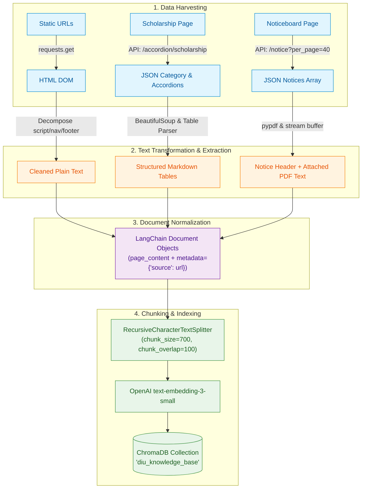

# Data Pipeline & Scraping

This guide details the data ingestion, dynamic web scraping, PDF parsing, text chunking, and vector indexing pipelines in **DIU Konnect (KonnectBuddy)**.

---

## 🎯 Target Sources & Coverage

DIU Konnect is configured to scrape and index four core institutional data surfaces:

| Target URL / Resource | Content Type | Ingestion Technique | Primary Information Indexed |
| :--- | :--- | :--- | :--- |
| `https://daffodilvarsity.edu.bd/noticeboard` | Static HTML + REST API + PDFs | Direct REST API (`/api/v1/public/notice`) + `pypdf` | Academic notices, semester deadlines, exam schedules, PDF circular attachments. |
| `https://alumni.daffodilvarsity.edu.bd/articles/membership-guidelines-28` | Article Sub-route HTML | Static HTML Scraper (`requests` + `BeautifulSoup`) | Alumni card application steps, fee breakdown (200 BDT + 300 BDT), collection office. |
| `https://alumni.daffodilvarsity.edu.bd/` | Portal Homepage HTML | Static HTML Scraper (`requests` + `BeautifulSoup`) | Alumni association structure, benefits, networking opportunities. |
| `https://daffodilvarsity.edu.bd/scholarship/diu-scholarship` | Dynamic Next.js Accordions | Direct REST API (`/api/v2/public/accordion/scholarship`) | Merit scholarships, waivers, freedom fighter quota, sibling discounts, CGPA thresholds. |

---

## ⚡ The Client-Side Dynamic Rendering Challenge

Modern web applications built with frameworks like **Next.js** frequently employ Client-Side Rendering (CSR) or selective hydration. 

### The Problem
When requesting pages like `https://daffodilvarsity.edu.bd/scholarship/diu-scholarship` using standard HTTP clients (`requests.get`), the returned HTML contains only empty layout shells and script tags:
```html
<div id="__next">
  <div class="accordion-wrapper"></div>
  <!-- Actual scholarship tables are fetched asynchronously by client JavaScript -->
</div>
```
A standard HTML scraper parsing this response indexes almost zero content, leading to complete retrieval failure.

### The Solution: Backend API Ingestion
Instead of deploying heavy headless browsers (such as Chromium via Playwright or Selenium), the pipeline queries DIU's backend API endpoints directly:
* **Scholarships Endpoint**: `https://webbackend.daffodilvarsity.edu.bd/api/v2/public/accordion/scholarship`
* **Noticeboard Endpoint**: `https://webbackend.daffodilvarsity.edu.bd/api/v1/public/notice?per_page=40`

This approach delivers:
1. **100% Data Fidelity**: Accesses raw, complete database records without UI occlusion.
2. **High Execution Speed**: Completes in hundreds of milliseconds without browser startup overhead.
3. **Low Resource Footprint**: Eliminates headless browser dependencies and CPU spikes.

---

## 📊 Ingestion Data Flow



---

## 📑 Specialized Ingestion Processors

### 1. Dynamic Accordions & Markdown Table Reconstruction
Implemented in `fetch_dynamic_scholarships(source_url, headers)`.

The DIU scholarship accordion API returns HTML snippets inside JSON keys. If HTML tables were stripped of tags naively, columns and rows would concatenate into unreadable character blocks. 

The custom extractor parses HTML tables and reconstructs them into structured Markdown tables:
```python
# Transform HTML table cells into markdown pipe-separated rows
for t in soup.find_all("table"):
    rows = []
    for tr in t.find_all("tr"):
        cells = [td.get_text(" ", strip=True) for td in tr.find_all(["th", "td"])]
        if cells:
            rows.append(" | ".join(cells))
    t.replace_with("\n" + "\n".join(rows) + "\n")
```

Each generated `Document` includes structured headers:
```text
DIU Scholarship & Waiver Policy
Category: Freedom Fighter & Ward Quota
Title: Special Waiver Scheme

[Structured Markdown Table]
```

### 2. In-Memory PDF Parsing for Notice Attachments
Implemented in `fetch_dynamic_notices(source_url, headers)`.

Many official university decisions (e.g., clearance notices, exam retake guidelines, fee deadline extensions) exist exclusively as scanned or generated `.pdf` attachments.

* The function iterates over `noticeFiles` attached to each notice.
* If a file ends with `.pdf`, it streams the file bytes directly into an `io.BytesIO` buffer.
* `pypdf.PdfReader` extracts text from the first 4 pages.
* The extracted text is prepended with notice metadata:
  ```text
  DIU Official Notice
  Title: Extension of Registration Fee Payment
  Department: Office of the Registrar
  Category: Academic
  Published Date: 2026-09-15
  Notice URL: https://daffodilvarsity.edu.bd/noticeboard/notice-slug
  Attachments: https://.../circular.pdf
  [Attached Notice PDF Content]:
  ...
  ```
* Individual notice URLs (`base_notice_url + "/" + slug`) are preserved in metadata, guaranteeing exact notice citations.

---

## ✂️ Chunking Strategy

Documents are split using `RecursiveCharacterTextSplitter`:
* **Chunk Size (`700`)**: Selected to fit approximately 100-150 words per chunk. This ensures each chunk represents a single policy rule, fee item, or notice section without diluting vector similarity.
* **Chunk Overlap (`100`)**: Prevents boundary severance, ensuring phrases that cross chunk boundaries (such as sentence predicates or table row context) remain coherent in at least one chunk.
* **Separators**: Standard hierarchical separators (`["\n\n", "\n", " ", ""]`).

---

## 💾 Vector Database Configuration

### ChromaDB Specification
* **Collection Name**: `diu_knowledge_base`
* **Storage Location**: `./chroma_db/` (relative to repository root)
* **Embedding Model**: OpenAI `text-embedding-3-small` (1536 output dimensions)
* **Distance Metric**: Squared L2 / Cosine Similarity

### Modes of Operation
1. **Persistent Mode (Default)**:
   * Checks if `./chroma_db/` directory exists.
   * If present, loads existing embeddings directly, bypassing scraping and OpenAI embedding API requests.
   * Eliminates latency and recurring API cost during repeated CLI/notebook runs.
2. **Forced Reindexing (`--reindex`)**:
   * Scrapes all live targets and APIs afresh.
   * Overwrites the Chroma collection on disk.
3. **In-Memory Mode (`--in-memory`)**:
   * Initializes Chroma without disk persistence.
   * Ideal for CI test suites and ephemeral environments.
