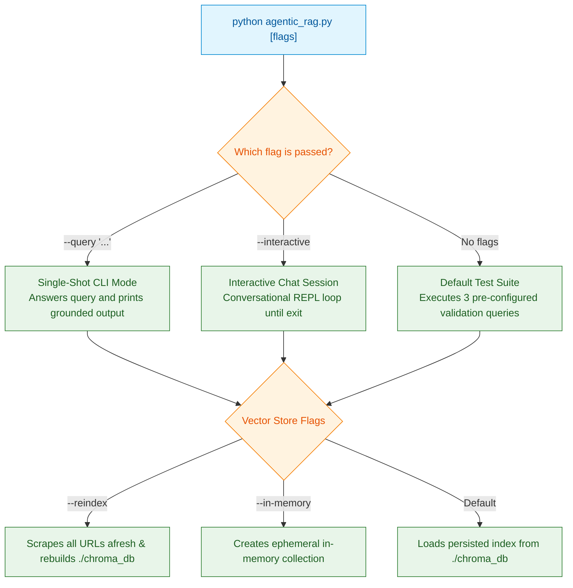

# Setup & Deployment Guide

This guide provides instructions for installing, configuring, running, and troubleshooting **DIU Konnect (KonnectBuddy)** on local environments and production servers.

---

## 💻 System Prerequisites

* **Operating System**: Linux (Ubuntu 20.04+, Debian, Fedora, Arch), macOS (12+), or Windows 10/11 (WSL2 recommended).
* **Python**: Version `3.10` or higher (`python3 --version`).
* **Package Manager**: `pip` (Python package installer).
* **OpenAI API Key**: Active key with permissions for:
  * Model: `gpt-4o-mini`
  * Embeddings: `text-embedding-3-small`

---

## 📦 Step-by-Step Installation

### 1. Clone the Repository
```bash
git clone <repository-url>
cd agenticBot
```

### 2. Create and Activate a Virtual Environment

#### On Linux / macOS:
```bash
python3 -m venv .venv
source .venv/bin/activate
```

#### On Windows (PowerShell):
```powershell
python -m venv .venv
.venv\Scripts\Activate.ps1
```

#### On Windows (Command Prompt):
```cmd
python -m venv .venv
.venv\Scripts\activate.bat
```

### 3. Install Python Dependencies
```bash
pip install --upgrade pip
pip install -r requirements.txt
```

#### Dependency Verification
You can verify installed versions using:
```bash
pip list | grep -E "langchain|chromadb|openai|pypdf"
```

---

## 🔑 Environment Configuration

The application requires an OpenAI API key. You can supply this in either of two ways:

### Option A: Using `.env` File (Recommended)
Copy the provided `.env.example` template:
```bash
cp .env.example .env
```
Open `.env` in your text editor and add your key:
```env
OPENAI_API_KEY="sk-proj-xxxxxxxxxxxxxxxxxxxxxxxxxxxxxxxx"
```

### Option B: Exporting in Shell Session
```bash
# On Linux / macOS
export OPENAI_API_KEY="sk-proj-xxxxxxxxxxxxxxxxxxxxxxxxxxxxxxxx"

# On Windows PowerShell
$env:OPENAI_API_KEY="sk-proj-xxxxxxxxxxxxxxxxxxxxxxxxxxxxxxxx"
```

---

## 🚀 Execution Modes

The primary entry point is `agentic_rag.py`. It supports four distinct execution modes:



### 1. Default Benchmark Test Suite
Runs three standardized benchmark queries (covering Banglish alumni queries, fee inquiries, and scholarship requirements):
```bash
python agentic_rag.py
```

### 2. Single Query Mode (`-q` / `--query`)
Pass a specific question directly on the command line:
```bash
# Banglish Query
python agentic_rag.py --query "@konnectbuddy kivabe alumni card collect korte hobe?"

# English Query
python agentic_rag.py --query "What is the fee for the 'I am Daffodilian' smart card?"

# Bengali Query
python agentic_rag.py --query "স্কলারশিপের জন্য সিজিপিএ কত থাকা লাগবে?"
```

### 3. Interactive REPL Mode (`-i` / `--interactive`)
Starts a continuous conversational loop with KonnectBuddy:
```bash
python agentic_rag.py --interactive
```
* Type your question and press `Enter`.
* Type `exit` or `quit` (or press `Ctrl+C`) to terminate the session.

### 4. Vector Store Control Flags

#### Force Re-scraping and Re-indexing (`--reindex`)
Use this when official university notices or scholarship policies have been updated online:
```bash
python agentic_rag.py --reindex
```

#### Ephemeral In-Memory Mode (`--in-memory`)
Runs without creating or reading `./chroma_db/` on disk:
```bash
python agentic_rag.py --in-memory --query "What are the alumni membership fees?"
```

---

## 📓 Running via Jupyter Notebook

To explore intermediate steps, inspect scraped chunks, or view agent tool invocations interactively:

1. Ensure the virtual environment kernel is available:
   ```bash
   python -m ipykernel install --user --name=agentic-rag --display-name "Python (DIU Agentic RAG)"
   ```
2. Start Jupyter:
   ```bash
   jupyter notebook agentic_rag_demo.ipynb
   ```
3. Select the `agentic-rag` kernel and execute cells sequentially.

---

## 🔧 Operational Troubleshooting

### Error: `[ERROR] OPENAI_API_KEY environment variable is not set!`
* **Cause**: Neither `.env` contains `OPENAI_API_KEY` nor has it been exported to the current shell environment.
* **Fix**: Ensure `.env` exists in the project root directory alongside `agentic_rag.py`, or run `export OPENAI_API_KEY="sk-..."`.

### Error: `Failed to fetch https://...: HTTP 500 / 503` or Network Timeout
* **Cause**: DIU institutional servers or backend APIs are temporarily unreachable or rate-limiting requests.
* **Fix**:
  * Check network connectivity and disable blocking firewalls or VPNs.
  * The scraper includes a 15-second timeout (`timeout=15`) with structured try/except wrappers; if one sub-endpoint fails, the pipeline logs a warning and proceeds with remaining sources.

### Notice: `pypdf not found`
* **Cause**: `pypdf` is not installed in the active environment.
* **Fix**: Run `pip install pypdf`. The code is guarded with `try ... except ImportError` and falls back gracefully to skip binary attachments if `pypdf` is unavailable.

### Chroma SQLite Error: `RuntimeError: Your system has an unsupported version of sqlite3`
* **Cause**: Legacy Linux distributions shipping SQLite `< 3.35.0`.
* **Fix**: Install `pysqlite3-binary` (`pip install pysqlite3-binary`) and add the standard override at the top of the script if running on older OS versions:
  ```python
  __import__('pysqlite3')
  import sys
  sys.modules['sqlite3'] = sys.modules.pop('pysqlite3')
  ```
