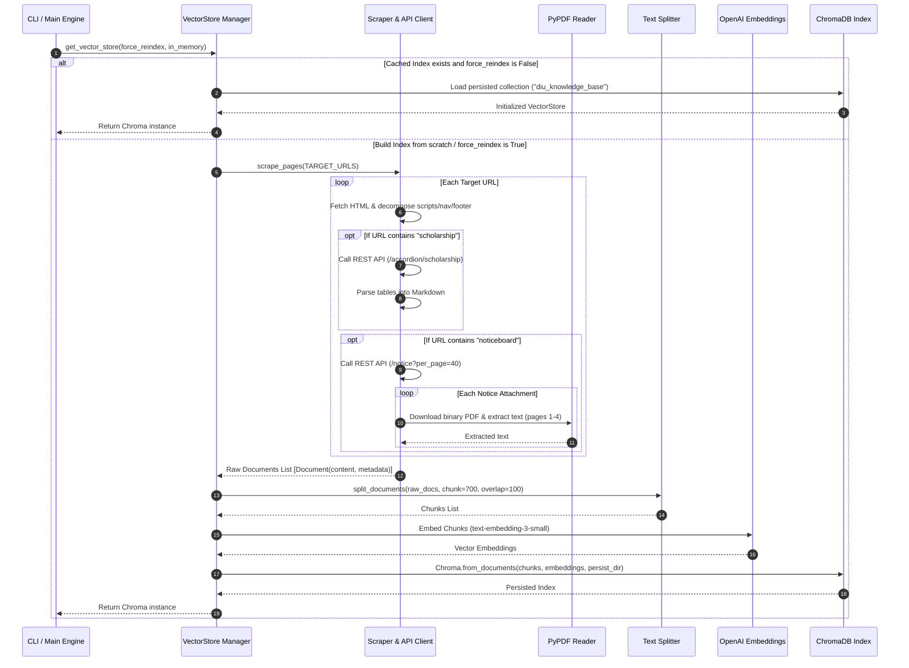
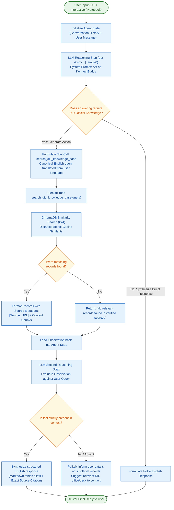
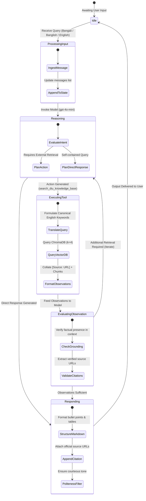
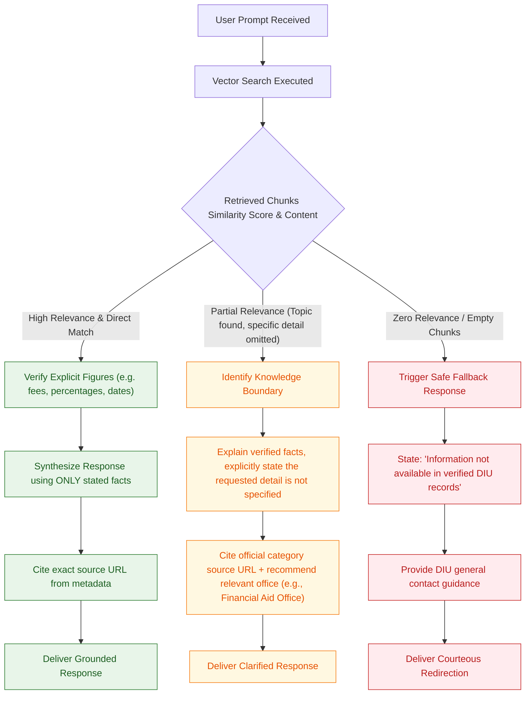

# Agent & System Workflows

This document outlines the operational workflows of **DIU Konnect (KonnectBuddy)** through detailed descriptions and professional Mermaid diagrams.

---

## 🔄 Lifecycle Overview

The DIU Konnect architecture operates across two primary operational lifecycles:
1. **Ingestion & Indexing Lifecycle (Offline / Setup Phase)**: Gathers, sanitizes, chunks, embeds, and stores verified institutional knowledge.
2. **Agentic ReAct Inference Lifecycle (Runtime Phase)**: Receives user queries across multilingual inputs, reasons over intent, queries the vector database using canonical terms, verifies retrieved evidence, and generates grounded responses.

---

## 1. Ingestion & Indexing Pipeline

The data ingestion workflow captures both static HTML and dynamic client-side content (Next.js backend APIs and binary notice PDFs) into ChromaDB.



---

## 2. Agentic ReAct Inference Lifecycle

The inference pipeline follows the **ReAct (Reason + Act)** paradigm. The agent dynamically decides whether external retrieval is required, constructs a targeted search string, analyzes retrieved context, and synthesizes a verified answer.



---

## 3. Agent State Machine

The following state machine details the internal states of the ReAct agent graph during an execution turn:



---

## 4. Cross-Lingual Query Resolution Sequence

A core design feature of DIU Konnect is bridging colloquial Banglish / Bengali queries with canonical English institutional documents in the vector store.

```mermaid
sequenceDiagram
    autonumber
    actor User
    participant Agent as KonnectBuddy ReAct Agent
    participant Tool as search_diu_knowledge_base
    participant VectorStore as ChromaDB Vector Store
    
    User->>Agent: "@konnectbuddy kivabe alumni card collect korte hobe?"
    Note over Agent: Detects Banglish query regarding Alumni Card collection & fee
    Note over Agent: System prompt mandates: "Formulate internal tool search queries in precise, canonical English terms"
    Agent->>Tool: search_diu_knowledge_base("alumni card collection procedure fee")
    Tool->>VectorStore: similarity_search("alumni card collection procedure fee", k=4)
    VectorStore-->>Tool: Top 4 chunks from /articles/membership-guidelines-28
    Tool-->>Agent: Observation with Source Metadata & Fee Details (200 BDT + 300 BDT)
    Note over Agent: System prompt mandates: "Rely solely on retrieved tool output; response in clear, professional English"
    Agent->>User: "To collect your DIU Alumni Card, please follow these official procedures... Fees: ... Source: https://alumni.daffodilvarsity.edu.bd/articles/membership-guidelines-28"
```

---

## 5. Hallucination Mitigation & Grounding Decision Tree

To ensure zero hallucinations in high-stakes university guidance (fees, graduation requirements, scholarships), the agent implements the following decision path:


